Title
================
Linh Nguyen
11/30/2022

<font size="5"> Loading the data </font>

``` r
marketing_data <- read.csv("/Users/billy/marketing_campaign.csv", header = TRUE)
head(marketing_data)
```

    ##     ID Year_Birth  Education Marital_Status Income Kidhome Teenhome Dt_Customer
    ## 1 5524       1957 Graduation         Single  58138       0        0    4/9/2012
    ## 2 2174       1954 Graduation         Single  46344       1        1    8/3/2014
    ## 3 4141       1965 Graduation       Together  71613       0        0  21-08-2013
    ## 4 6182       1984 Graduation       Together  26646       1        0   10/2/2014
    ## 5 5324       1981        PhD        Married  58293       1        0  19-01-2014
    ## 6 7446       1967     Master       Together  62513       0        1    9/9/2013
    ##   Recency MntWines MntFruits MntMeatProducts MntFishProducts MntSweetProducts
    ## 1      58      635        88             546             172               88
    ## 2      38       11         1               6               2                1
    ## 3      26      426        49             127             111               21
    ## 4      26       11         4              20              10                3
    ## 5      94      173        43             118              46               27
    ## 6      16      520        42              98               0               42
    ##   MntGoldProds NumDealsPurchases NumWebPurchases NumCatalogPurchases
    ## 1           88                 3               8                  10
    ## 2            6                 2               1                   1
    ## 3           42                 1               8                   2
    ## 4            5                 2               2                   0
    ## 5           15                 5               5                   3
    ## 6           14                 2               6                   4
    ##   NumStorePurchases NumWebVisitsMonth AcceptedCmp3 AcceptedCmp4 AcceptedCmp5
    ## 1                 4                 7            0            0            0
    ## 2                 2                 5            0            0            0
    ## 3                10                 4            0            0            0
    ## 4                 4                 6            0            0            0
    ## 5                 6                 5            0            0            0
    ## 6                10                 6            0            0            0
    ##   AcceptedCmp1 AcceptedCmp2 Complain Z_CostContact Z_Revenue Response
    ## 1            0            0        0             3        11        1
    ## 2            0            0        0             3        11        0
    ## 3            0            0        0             3        11        0
    ## 4            0            0        0             3        11        0
    ## 5            0            0        0             3        11        0
    ## 6            0            0        0             3        11        0

<font size="5"> Data Cleaning </font>

Adjusting the values in education columnn and marital status column

``` r
marketing_data$Education[marketing_data$Education=="2n Cycle"]= "Master"
marketing_data$Education[marketing_data$Education=="Basic"]= "Highschool"
marketing_data$Education[marketing_data$Education=="Graduation"]= "Undergraduate"
marketing_data$Marital_Status[marketing_data$Marital_Status=="Divorced"]= "Single"
marketing_data$Marital_Status[marketing_data$Marital_Status=="Widow"]= "Single"
marketing_data$Marital_Status[marketing_data$Marital_Status=="Alone"]= "Single"
marketing_data$Marital_Status[marketing_data$Marital_Status=="Absurd"]= "Single"
marketing_data$Marital_Status[marketing_data$Marital_Status=="YOLO"]= "Single"
marketing_data$Marital_Status[marketing_data$Marital_Status=="Together"]= "Relationship"
marketing_data$Marital_Status[marketing_data$Marital_Status=="Married"]= "Relationship"
head(marketing_data)
```

    ##     ID Year_Birth     Education Marital_Status Income Kidhome Teenhome
    ## 1 5524       1957 Undergraduate         Single  58138       0        0
    ## 2 2174       1954 Undergraduate         Single  46344       1        1
    ## 3 4141       1965 Undergraduate   Relationship  71613       0        0
    ## 4 6182       1984 Undergraduate   Relationship  26646       1        0
    ## 5 5324       1981           PhD   Relationship  58293       1        0
    ## 6 7446       1967        Master   Relationship  62513       0        1
    ##   Dt_Customer Recency MntWines MntFruits MntMeatProducts MntFishProducts
    ## 1    4/9/2012      58      635        88             546             172
    ## 2    8/3/2014      38       11         1               6               2
    ## 3  21-08-2013      26      426        49             127             111
    ## 4   10/2/2014      26       11         4              20              10
    ## 5  19-01-2014      94      173        43             118              46
    ## 6    9/9/2013      16      520        42              98               0
    ##   MntSweetProducts MntGoldProds NumDealsPurchases NumWebPurchases
    ## 1               88           88                 3               8
    ## 2                1            6                 2               1
    ## 3               21           42                 1               8
    ## 4                3            5                 2               2
    ## 5               27           15                 5               5
    ## 6               42           14                 2               6
    ##   NumCatalogPurchases NumStorePurchases NumWebVisitsMonth AcceptedCmp3
    ## 1                  10                 4                 7            0
    ## 2                   1                 2                 5            0
    ## 3                   2                10                 4            0
    ## 4                   0                 4                 6            0
    ## 5                   3                 6                 5            0
    ## 6                   4                10                 6            0
    ##   AcceptedCmp4 AcceptedCmp5 AcceptedCmp1 AcceptedCmp2 Complain Z_CostContact
    ## 1            0            0            0            0        0             3
    ## 2            0            0            0            0        0             3
    ## 3            0            0            0            0        0             3
    ## 4            0            0            0            0        0             3
    ## 5            0            0            0            0        0             3
    ## 6            0            0            0            0        0             3
    ##   Z_Revenue Response
    ## 1        11        1
    ## 2        11        0
    ## 3        11        0
    ## 4        11        0
    ## 5        11        0
    ## 6        11        0

  - Adding more columns included:
      - Children home: add all the children of the customer
      - Total amount spent: add all the amount of money customer spent
        on all the prducts
      - Total purchases: add all the purchases of the customer on all
        type of purchases
      - Total accepted campaign: all all the marketing campaigns that
        the customer accepted
      - Parent: dummy variable indicates whether the customer is a
        parent

<!-- end list -->

``` r
marketing_data$Childrenhome <- marketing_data$Kidhome +marketing_data$Teenhome
marketing_data$TotalAmountSpent = marketing_data$MntWines + marketing_data$MntFruits + marketing_data$MntMeatProducts + marketing_data$MntFishProducts + marketing_data$MntSweetProducts + marketing_data$MntGoldProds
marketing_data$TotalPurchases = marketing_data$NumWebPurchases + marketing_data$NumCatalogPurchases + marketing_data$NumStorePurchases + marketing_data$NumDealsPurchases 
marketing_data$TotalAcceptedCmp = marketing_data$AcceptedCmp1 + marketing_data$AcceptedCmp2 + marketing_data$AcceptedCmp3 + marketing_data$AcceptedCmp4 + marketing_data$AcceptedCmp5 + marketing_data$Response
marketing_data$Parent <- ifelse(marketing_data$Childrenhome != 0,1, 0)
head(marketing_data)
```

    ##     ID Year_Birth     Education Marital_Status Income Kidhome Teenhome
    ## 1 5524       1957 Undergraduate         Single  58138       0        0
    ## 2 2174       1954 Undergraduate         Single  46344       1        1
    ## 3 4141       1965 Undergraduate   Relationship  71613       0        0
    ## 4 6182       1984 Undergraduate   Relationship  26646       1        0
    ## 5 5324       1981           PhD   Relationship  58293       1        0
    ## 6 7446       1967        Master   Relationship  62513       0        1
    ##   Dt_Customer Recency MntWines MntFruits MntMeatProducts MntFishProducts
    ## 1    4/9/2012      58      635        88             546             172
    ## 2    8/3/2014      38       11         1               6               2
    ## 3  21-08-2013      26      426        49             127             111
    ## 4   10/2/2014      26       11         4              20              10
    ## 5  19-01-2014      94      173        43             118              46
    ## 6    9/9/2013      16      520        42              98               0
    ##   MntSweetProducts MntGoldProds NumDealsPurchases NumWebPurchases
    ## 1               88           88                 3               8
    ## 2                1            6                 2               1
    ## 3               21           42                 1               8
    ## 4                3            5                 2               2
    ## 5               27           15                 5               5
    ## 6               42           14                 2               6
    ##   NumCatalogPurchases NumStorePurchases NumWebVisitsMonth AcceptedCmp3
    ## 1                  10                 4                 7            0
    ## 2                   1                 2                 5            0
    ## 3                   2                10                 4            0
    ## 4                   0                 4                 6            0
    ## 5                   3                 6                 5            0
    ## 6                   4                10                 6            0
    ##   AcceptedCmp4 AcceptedCmp5 AcceptedCmp1 AcceptedCmp2 Complain Z_CostContact
    ## 1            0            0            0            0        0             3
    ## 2            0            0            0            0        0             3
    ## 3            0            0            0            0        0             3
    ## 4            0            0            0            0        0             3
    ## 5            0            0            0            0        0             3
    ## 6            0            0            0            0        0             3
    ##   Z_Revenue Response Childrenhome TotalAmountSpent TotalPurchases
    ## 1        11        1            0             1617             25
    ## 2        11        0            2               27              6
    ## 3        11        0            0              776             21
    ## 4        11        0            1               53              8
    ## 5        11        0            1              422             19
    ## 6        11        0            1              716             22
    ##   TotalAcceptedCmp Parent
    ## 1                1      0
    ## 2                0      1
    ## 3                0      0
    ## 4                0      1
    ## 5                0      1
    ## 6                0      1

Checking for how many NA values we have in the dataset

``` r
sum(is.na(marketing_data))
```

    ## [1] 24

**Since there are only 24 NA values in Income column, we remove those NA
values and also remove one outlier variable in income column**

``` r
df <- marketing_data[-c(11,28,44,49,59,72,91,92,93,129,134,313,320,1380,1383,1384,1387,2060,2062,2079,2080,2082,2085,2229,2234),]
```

Creating 1 more column for age (age = current year - birth date)

``` r
df$Age <- 2022 - df$Year_Birth
head(df)
```

    ##     ID Year_Birth     Education Marital_Status Income Kidhome Teenhome
    ## 1 5524       1957 Undergraduate         Single  58138       0        0
    ## 2 2174       1954 Undergraduate         Single  46344       1        1
    ## 3 4141       1965 Undergraduate   Relationship  71613       0        0
    ## 4 6182       1984 Undergraduate   Relationship  26646       1        0
    ## 5 5324       1981           PhD   Relationship  58293       1        0
    ## 6 7446       1967        Master   Relationship  62513       0        1
    ##   Dt_Customer Recency MntWines MntFruits MntMeatProducts MntFishProducts
    ## 1    4/9/2012      58      635        88             546             172
    ## 2    8/3/2014      38       11         1               6               2
    ## 3  21-08-2013      26      426        49             127             111
    ## 4   10/2/2014      26       11         4              20              10
    ## 5  19-01-2014      94      173        43             118              46
    ## 6    9/9/2013      16      520        42              98               0
    ##   MntSweetProducts MntGoldProds NumDealsPurchases NumWebPurchases
    ## 1               88           88                 3               8
    ## 2                1            6                 2               1
    ## 3               21           42                 1               8
    ## 4                3            5                 2               2
    ## 5               27           15                 5               5
    ## 6               42           14                 2               6
    ##   NumCatalogPurchases NumStorePurchases NumWebVisitsMonth AcceptedCmp3
    ## 1                  10                 4                 7            0
    ## 2                   1                 2                 5            0
    ## 3                   2                10                 4            0
    ## 4                   0                 4                 6            0
    ## 5                   3                 6                 5            0
    ## 6                   4                10                 6            0
    ##   AcceptedCmp4 AcceptedCmp5 AcceptedCmp1 AcceptedCmp2 Complain Z_CostContact
    ## 1            0            0            0            0        0             3
    ## 2            0            0            0            0        0             3
    ## 3            0            0            0            0        0             3
    ## 4            0            0            0            0        0             3
    ## 5            0            0            0            0        0             3
    ## 6            0            0            0            0        0             3
    ##   Z_Revenue Response Childrenhome TotalAmountSpent TotalPurchases
    ## 1        11        1            0             1617             25
    ## 2        11        0            2               27              6
    ## 3        11        0            0              776             21
    ## 4        11        0            1               53              8
    ## 5        11        0            1              422             19
    ## 6        11        0            1              716             22
    ##   TotalAcceptedCmp Parent Age
    ## 1                1      0  65
    ## 2                0      1  68
    ## 3                0      0  57
    ## 4                0      1  38
    ## 5                0      1  41
    ## 6                0      1  55

<font size="5"> EDA - Overall analysis of the variables interested
</font>

Density plot of the incomes

``` r
d <- density(df$Income)
plot(d, main="Kernel Density of Incomes")
polygon(d, col="red", border="blue")
```

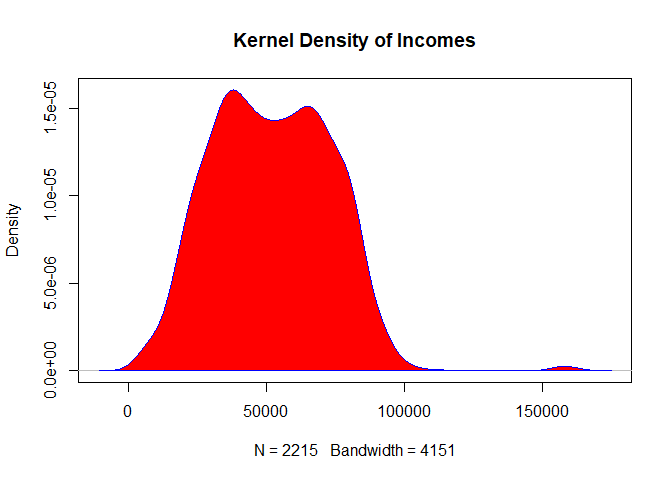<!-- -->

**The incomes are mostly below 100k**

Density plot of age

``` r
d2 <- density(df$Age)
plot(d2, main="Kernel Density of Age")
polygon(d2, col="red", border="blue")
```

<!-- -->

**Most customer ages are from 40-60**

Histogram of the education

``` r
hist(df$Childrenhome, main="Children of customer", xlab="Number of children",col="blue")
```

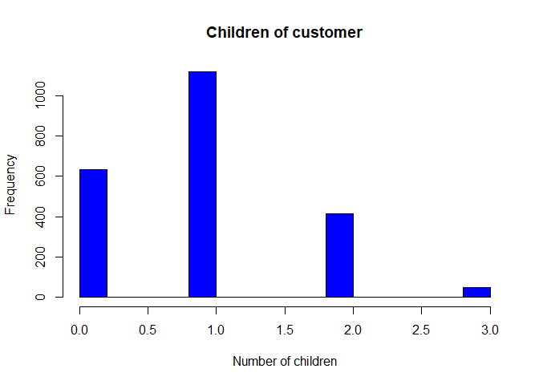<!-- -->

**Most customers have one child**

*install ggplot2*

``` r
library(ggplot2)
```

    ## Warning: package 'ggplot2' was built under R version 4.1.3

Box plot for education status on total amnount spent

``` r
ggplot(df,aes(x=Education,y=TotalAmountSpent,fill=Education))+geom_boxplot()
```

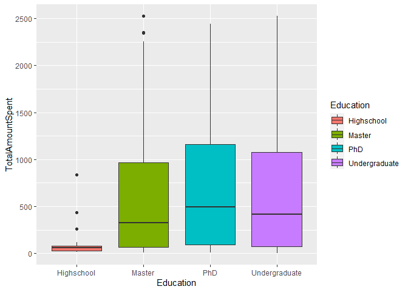<!-- -->

**PHD graduate spent the most and highschool graduate spent the least**

Box plot for education status on total purchases

``` r
ggplot(df,aes(x=Education,y=TotalPurchases,fill=Education))+geom_boxplot()
```

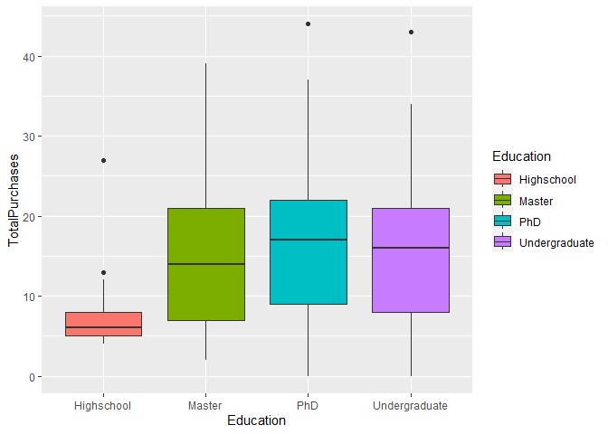<!-- -->

**PHD gradute still purchase the most and highschool gradute still
purchases the least**

*install yarrr*

``` r
library(yarrr)
```

    ## Warning: package 'yarrr' was built under R version 4.1.3

    ## Loading required package: jpeg

    ## Loading required package: BayesFactor

    ## Warning: package 'BayesFactor' was built under R version 4.1.3

    ## Loading required package: coda

    ## Loading required package: Matrix

    ## ************
    ## Welcome to BayesFactor 0.9.12-4.4. If you have questions, please contact Richard Morey (richarddmorey@gmail.com).
    ## 
    ## Type BFManual() to open the manual.
    ## ************

    ## Loading required package: circlize

    ## Warning: package 'circlize' was built under R version 4.1.3

    ## ========================================
    ## circlize version 0.4.15
    ## CRAN page: https://cran.r-project.org/package=circlize
    ## Github page: https://github.com/jokergoo/circlize
    ## Documentation: https://jokergoo.github.io/circlize_book/book/
    ## 
    ## If you use it in published research, please cite:
    ## Gu, Z. circlize implements and enhances circular visualization
    ##   in R. Bioinformatics 2014.
    ## 
    ## This message can be suppressed by:
    ##   suppressPackageStartupMessages(library(circlize))
    ## ========================================

    ## yarrr v0.1.5. Citation info at citation('yarrr'). Package guide at yarrr.guide()

    ## Email me at Nathaniel.D.Phillips.is@gmail.com

    ## 
    ## Attaching package: 'yarrr'

    ## The following object is masked from 'package:ggplot2':
    ## 
    ##     diamonds

Pirate plot of the total amount spending vs marital status (single vs
relationship)

``` r
yarrr::pirateplot(formula = TotalAmountSpent ~ Marital_Status, 
                  data = df,
                  main = "Pirateplot of Spending",
                  xlab = "Marital Status ",
                  ylab = "Total Amount Spent", theme=1)
```

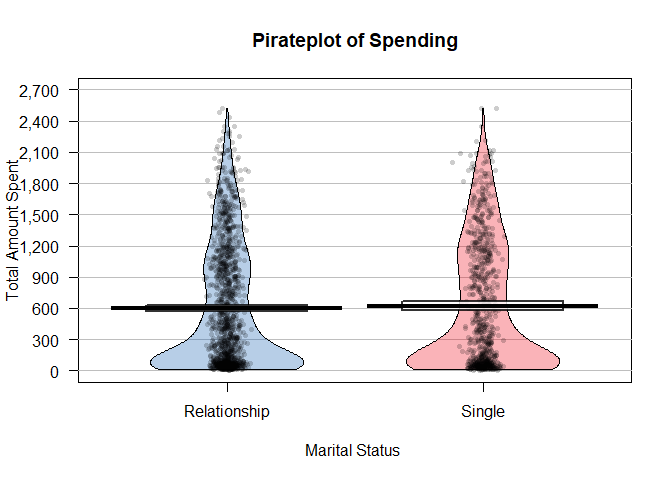<!-- -->

**For the mean on the plot, Single status spent slightly more than
Relationship status, but there are no sinificant difference**

Pirate plot of the total purchases vs marital status (single vs
relationship)

``` r
yarrr::pirateplot(formula = TotalPurchases ~ Marital_Status, 
                  data = df,
                  main = "Pirateplot of Purchases",
                  xlab = "Marital Status",
                  ylab = "Total Purchases", theme=1)
```

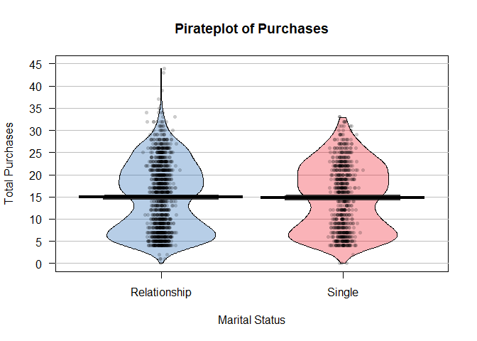<!-- -->

**The means are close on the plot but Relationship status seems to
purchase a little more times than single status The points in the
relationship status spread to the top might indicates that relationship
status splitted their spending into more purchases (only purchase when
needed), and single status might spend more for unnecessary things**

Create new data frame for PCA, remove the columns that dont use and
create a marital status dummy column

``` r
new_df <- subset(df, select = -c(ID, Education, Marital_Status, Year_Birth, Dt_Customer, Complain, Z_CostContact,Z_Revenue, Kidhome, Teenhome ) )
new_df$MaritalDummy <- ifelse(df$Marital_Status != "Single",1, 0)
```

*Install reshape2*

``` r
library(reshape2)
```

    ## Warning: package 'reshape2' was built under R version 4.1.3

Correlation matrix between the column using heatmap

``` r
corr_mat <- round(cor(new_df),2)
meltdata=melt(corr_mat)
p=ggplot(data = meltdata, aes(x=Var1, y=Var2, fill=value)) + 
  geom_tile()
#Rotate varibles display on x axis
p + geom_boxplot() + theme(axis.text.x = element_text(angle = 60, hjust = 1))
```

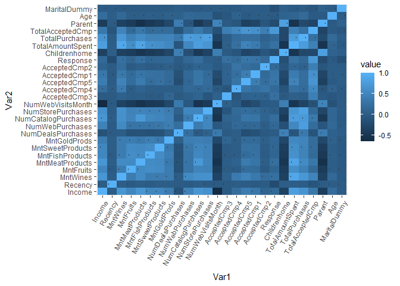<!-- -->

In the heat map, the box with the light blue indicated the 2 variables
are highly correlated and the boxes with dark blue indicated the 2
variables are not correlated

<font size="5"> PCA for continous variables </font>

``` r
market_pc <- princomp(new_df, cor=T); summary(market_pc, loadings=T,cutoff=0)
```

    ## Importance of components:
    ##                           Comp.1    Comp.2     Comp.3     Comp.4     Comp.5
    ## Standard deviation     2.9585045 1.6144588 1.53439156 1.17816533 1.02450150
    ## Proportion of Variance 0.3366442 0.1002491 0.09055221 0.05338744 0.04036936
    ## Cumulative Proportion  0.3366442 0.4368933 0.52744553 0.58083297 0.62120233
    ##                            Comp.6     Comp.7     Comp.8     Comp.9    Comp.10
    ## Standard deviation     1.00488062 0.99645100 0.92784415 0.89191728 0.87652059
    ## Proportion of Variance 0.03883789 0.03818902 0.03311134 0.03059679 0.02954955
    ## Cumulative Proportion  0.66004021 0.69822924 0.73134057 0.76193736 0.79148691
    ##                           Comp.11    Comp.12    Comp.13    Comp.14    Comp.15
    ## Standard deviation     0.82726373 0.78835883 0.78231183 0.75306781 0.69731758
    ## Proportion of Variance 0.02632174 0.02390422 0.02353892 0.02181197 0.01870199
    ## Cumulative Proportion  0.81780865 0.84171287 0.86525179 0.88706375 0.90576575
    ##                           Comp.16    Comp.17   Comp.18    Comp.19    Comp.20
    ## Standard deviation     0.68071852 0.65224362 0.6172573 0.58924555 0.52050791
    ## Proportion of Variance 0.01782222 0.01636237 0.0146541 0.01335424 0.01042033
    ## Cumulative Proportion  0.92358796 0.93995034 0.9546044 0.96795868 0.97837901
    ##                            Comp.21     Comp.22     Comp.23      Comp.24
    ## Standard deviation     0.479035202 0.421966760 0.393211326 7.533282e-08
    ## Proportion of Variance 0.008825951 0.006848306 0.005946736 2.182705e-16
    ## Cumulative Proportion  0.987204958 0.994053264 1.000000000 1.000000e+00
    ##                             Comp.25 Comp.26
    ## Standard deviation     4.489610e-08       0
    ## Proportion of Variance 7.752539e-17       0
    ## Cumulative Proportion  1.000000e+00       1
    ## 
    ## Loadings:
    ##                     Comp.1 Comp.2 Comp.3 Comp.4 Comp.5 Comp.6 Comp.7 Comp.8
    ## Income               0.282  0.076  0.028  0.150  0.079  0.076  0.149  0.092
    ## Recency             -0.001  0.089 -0.010  0.246 -0.522 -0.660  0.285  0.138
    ## MntWines             0.272 -0.050  0.187  0.143  0.004 -0.022 -0.022 -0.067
    ## MntFruits            0.223  0.148 -0.120 -0.164 -0.040  0.005 -0.065  0.093
    ## MntMeatProducts      0.276  0.055 -0.112 -0.033 -0.004  0.006  0.020  0.132
    ## MntFishProducts      0.232  0.147 -0.132 -0.138 -0.046  0.009 -0.037  0.087
    ## MntSweetProducts     0.225  0.128 -0.102 -0.113 -0.082 -0.003 -0.059  0.180
    ## MntGoldProds         0.187  0.095  0.089 -0.247 -0.123 -0.095  0.053 -0.220
    ## NumDealsPurchases   -0.041  0.116  0.492 -0.137 -0.034 -0.021 -0.103  0.162
    ## NumWebPurchases      0.185  0.116  0.354 -0.093 -0.004 -0.028 -0.115 -0.114
    ## NumCatalogPurchases  0.277  0.063  0.022 -0.038 -0.014  0.002  0.123 -0.014
    ## NumStorePurchases    0.242  0.185  0.155  0.107  0.040  0.016 -0.129 -0.123
    ## NumWebVisitsMonth   -0.202 -0.116  0.266 -0.181 -0.102 -0.104 -0.239 -0.053
    ## AcceptedCmp3         0.027 -0.229  0.049 -0.484 -0.247 -0.021  0.448 -0.294
    ## AcceptedCmp4         0.092 -0.282  0.180  0.418  0.056 -0.083 -0.231  0.005
    ## AcceptedCmp5         0.176 -0.312 -0.040  0.158 -0.101  0.057  0.025  0.228
    ## AcceptedCmp1         0.155 -0.284 -0.012  0.042 -0.108  0.093  0.067  0.391
    ## AcceptedCmp2         0.058 -0.284  0.090  0.231 -0.082 -0.115 -0.112 -0.545
    ## Response             0.110 -0.376  0.070 -0.325  0.226  0.029 -0.008  0.119
    ## Childrenhome        -0.199  0.034  0.347  0.025 -0.013  0.075  0.221  0.324
    ## TotalAmountSpent     0.322  0.032  0.044  0.016 -0.022 -0.017 -0.012  0.019
    ## TotalPurchases       0.264  0.173  0.324 -0.037  0.002 -0.008 -0.075 -0.058
    ## TotalAcceptedCmp     0.180 -0.506  0.092 -0.061 -0.035  0.008  0.071  0.066
    ## Parent              -0.206  0.054  0.363 -0.010 -0.068  0.060  0.090  0.204
    ## Age                  0.041  0.087  0.143  0.261  0.425  0.101  0.655 -0.155
    ## MaritalDummy        -0.010  0.050  0.028  0.183 -0.593  0.695  0.048 -0.123
    ##                     Comp.9 Comp.10 Comp.11 Comp.12 Comp.13 Comp.14 Comp.15
    ## Income               0.060  0.233   0.099   0.019   0.013   0.008   0.166 
    ## Recency             -0.124 -0.096  -0.141  -0.110  -0.005   0.058   0.235 
    ## MntWines            -0.176  0.089   0.144   0.005   0.009   0.114  -0.155 
    ## MntFruits            0.300 -0.147   0.035  -0.356   0.043   0.015  -0.074 
    ## MntMeatProducts     -0.103  0.216  -0.301  -0.023   0.022  -0.038  -0.125 
    ## MntFishProducts      0.290 -0.218  -0.060  -0.099  -0.073  -0.194  -0.102 
    ## MntSweetProducts     0.303 -0.167   0.038  -0.308  -0.125   0.201  -0.082 
    ## MntGoldProds         0.141 -0.308   0.140   0.395   0.628  -0.255   0.083 
    ## NumDealsPurchases   -0.024  0.079  -0.470   0.044   0.049  -0.144  -0.263 
    ## NumWebPurchases     -0.180 -0.247   0.238  -0.007  -0.157   0.286   0.203 
    ## NumCatalogPurchases -0.083  0.240  -0.255   0.090  -0.021  -0.203  -0.063 
    ## NumStorePurchases    0.009  0.121   0.218   0.037  -0.166   0.078   0.181 
    ## NumWebVisitsMonth   -0.140 -0.342  -0.089  -0.109  -0.088   0.155  -0.327 
    ## AcceptedCmp3        -0.057  0.234   0.269  -0.159  -0.235  -0.147  -0.210 
    ## AcceptedCmp4        -0.031 -0.104   0.200  -0.355   0.043  -0.604  -0.053 
    ## AcceptedCmp5        -0.077  0.064   0.143   0.024   0.440   0.455  -0.350 
    ## AcceptedCmp1         0.116 -0.297   0.020   0.563  -0.451  -0.094  -0.002 
    ## AcceptedCmp2         0.576  0.119  -0.302   0.100  -0.086   0.215   0.009 
    ## Response            -0.094 -0.056  -0.305  -0.229   0.145   0.094   0.580 
    ## Childrenhome         0.346  0.176   0.058  -0.043   0.117   0.016   0.019 
    ## TotalAmountSpent    -0.058  0.063  -0.020  -0.025   0.055   0.024  -0.146 
    ## TotalPurchases      -0.098  0.075  -0.038   0.059  -0.122   0.022   0.060 
    ## TotalAcceptedCmp     0.021 -0.032   0.023  -0.068  -0.005  -0.048   0.054 
    ## Parent               0.286  0.159   0.245  -0.042   0.054   0.010   0.130 
    ## Age                 -0.015 -0.416  -0.154  -0.116  -0.015   0.065  -0.136 
    ## MaritalDummy        -0.121 -0.136  -0.166  -0.138   0.053  -0.024   0.158 
    ##                     Comp.16 Comp.17 Comp.18 Comp.19 Comp.20 Comp.21 Comp.22
    ## Income               0.085   0.092   0.097   0.139   0.305   0.137   0.647 
    ## Recency             -0.015  -0.068  -0.050  -0.011  -0.004   0.015   0.009 
    ## MntWines             0.318  -0.050  -0.105  -0.336   0.085   0.529  -0.164 
    ## MntFruits            0.113  -0.626   0.440   0.106  -0.087   0.081  -0.006 
    ## MntMeatProducts      0.272   0.082   0.087  -0.026   0.308  -0.618  -0.242 
    ## MntFishProducts      0.154   0.030  -0.735   0.316  -0.043   0.070   0.020 
    ## MntSweetProducts    -0.344   0.565   0.155  -0.347   0.005   0.053  -0.016 
    ## MntGoldProds        -0.026   0.074   0.089  -0.156   0.067  -0.075   0.033 
    ## NumDealsPurchases   -0.401  -0.110   0.008   0.094   0.226   0.235  -0.081 
    ## NumWebPurchases      0.108   0.205   0.159   0.523   0.104  -0.061  -0.151 
    ## NumCatalogPurchases  0.123   0.192   0.165   0.052  -0.699   0.040   0.169 
    ## NumStorePurchases   -0.321  -0.362  -0.296  -0.365  -0.069  -0.345   0.098 
    ## NumWebVisitsMonth    0.330   0.002  -0.036  -0.231  -0.103  -0.223   0.471 
    ## AcceptedCmp3        -0.114  -0.022  -0.020   0.028   0.111  -0.030   0.001 
    ## AcceptedCmp4        -0.064   0.102   0.084   0.056   0.019  -0.107  -0.011 
    ## AcceptedCmp5        -0.230  -0.064  -0.127   0.227  -0.178  -0.105   0.019 
    ## AcceptedCmp1         0.011  -0.107   0.131  -0.067   0.017   0.004  -0.035 
    ## AcceptedCmp2         0.059   0.027   0.040   0.068   0.037  -0.013  -0.031 
    ## Response             0.037  -0.037  -0.120  -0.133  -0.027   0.066  -0.001 
    ## Childrenhome         0.159   0.010  -0.040  -0.026   0.146  -0.112   0.206 
    ## TotalAmountSpent     0.275   0.009  -0.046  -0.199   0.159   0.075  -0.179 
    ## TotalPurchases      -0.151  -0.034  -0.004   0.076  -0.202  -0.094   0.032 
    ## TotalAcceptedCmp    -0.094  -0.036  -0.025   0.028  -0.015  -0.045  -0.011 
    ## Parent               0.233   0.068  -0.028  -0.072  -0.298  -0.077  -0.350 
    ## Age                 -0.045  -0.042  -0.011  -0.055  -0.043  -0.081  -0.060 
    ## MaritalDummy         0.015  -0.011  -0.014  -0.038   0.015   0.010   0.007 
    ##                     Comp.23 Comp.24 Comp.25 Comp.26
    ## Income               0.422   0.000   0.000   0.000 
    ## Recency              0.017   0.000   0.000   0.000 
    ## MntWines            -0.111   0.064  -0.455   0.034 
    ## MntFruits           -0.001   0.008  -0.054   0.004 
    ## MntMeatProducts      0.072   0.042  -0.302   0.022 
    ## MntFishProducts      0.025   0.010  -0.074   0.005 
    ## MntSweetProducts    -0.015   0.008  -0.055   0.004 
    ## MntGoldProds         0.007   0.010  -0.070   0.005 
    ## NumDealsPurchases    0.165   0.031  -0.011  -0.201 
    ## NumWebPurchases     -0.137   0.044  -0.015  -0.286 
    ## NumCatalogPurchases -0.147   0.047  -0.016  -0.306 
    ## NumStorePurchases   -0.026   0.053  -0.018  -0.340 
    ## NumWebVisitsMonth    0.143   0.000   0.000   0.000 
    ## AcceptedCmp3         0.015  -0.233  -0.035  -0.034 
    ## AcceptedCmp4        -0.034  -0.234  -0.035  -0.034 
    ## AcceptedCmp5         0.039  -0.232  -0.035  -0.034 
    ## AcceptedCmp1         0.014  -0.219  -0.033  -0.032 
    ## AcceptedCmp2         0.009  -0.103  -0.016  -0.015 
    ## Response            -0.002  -0.319  -0.048  -0.047 
    ## Childrenhome        -0.636   0.000   0.000   0.000 
    ## TotalAmountSpent    -0.033  -0.114   0.813  -0.060 
    ## TotalPurchases      -0.075  -0.124   0.042   0.802 
    ## TotalAcceptedCmp     0.010   0.796   0.120   0.117 
    ## Parent               0.543   0.000   0.000   0.000 
    ## Age                  0.074   0.000   0.000   0.000 
    ## MaritalDummy        -0.009   0.000   0.000   0.000

``` r
#Graph the scree plot
plot(1:(length(market_pc$sdev)),  (market_pc$sdev)^2, type='b', 
     main="Scree Plot", xlab="Number of Components", ylab="Eigenvalue Size")
```

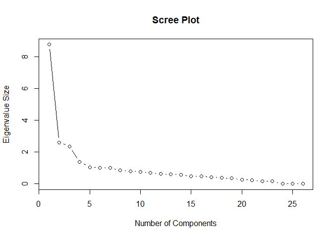<!-- -->

**Based on the scree plot and eigenvalues, the first 4 or 5 components
are the most sufficient components to keep in the analysis.**

  - Principal component 1:
      - PC 1 is a measured of total amount spent, parent.
      - The customers in PC 1 tend to have higher spending amount and
        not a parent, less number of web visit, high income, high
        purchases on meat and wine, high number of catalog purchases.
  - Principal component 2:
      - PC2 is the measured of total amount accepted compaign and number
        of in store purchases.
      - The customers in PC 2 tend to not accepting any marketing
        compaign and have high in store purchases.
  - Principal component 3:
      - PC3 is measure of number of deal purchases, number of web
        purchases, and number of children at home.
      - The customers in PC3 tend to be parents, most of their purchases
        are online and most of the purchases are deals.
  - Principal component 4:
      - PC4 is measured of customer accepted campaign 3,4 and 6
        (response).
      - The customers in PC4 tend to accepted into compaign 4 but not
        campaign 3 and 6(response), a customer in this PC also a bit
        older and less likely to spend on gold product.
  - Principal component 5:
      - PC5 is measured recency, age, marital status.
      - The customers in PC5 tend to have higher recency, higher age,
        and a single.

<font size="5"> Cluster Analysis </font>

Calculate the standard deviation

``` r
std <- apply(new_df, 2, sd)
market.std <- sweep(new_df,2,std,FUN="/") 
#Plot the WsS for several choices of k
my.data.matrix <- market.std  
my.k.choices <- 2:8
n <- length(my.data.matrix[,1])
wss1 <- (n-1)*sum(apply(my.data.matrix,2,var))
wss <- numeric(0)
for(i in my.k.choices) {
  W <- sum(kmeans(my.data.matrix,i)$withinss)
  wss <- c(wss,W)
}
wss <- c(wss1,wss)
#Plot the Within Cluster Sums of Squares graph to determine the number of cluster
plot(c(1,my.k.choices),wss,type='l',xlab='Number of clusters', ylab='Within-groups sum-of-squares', lwd=2)
```

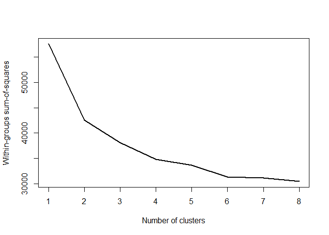<!-- -->

**Based on Wss graph, 2 or 3 or 4 is a good choices for K**

Run the kmeans model with k = 3

``` r
market.k3 <- kmeans(market.std, centers=3, iter.max=100, nstart=25)
```

\*install factoextra

``` r
library(factoextra)
```

    ## Warning: package 'factoextra' was built under R version 4.1.3

    ## Welcome! Want to learn more? See two factoextra-related books at https://goo.gl/ve3WBa

Visualizing the 3 clusters

``` r
fviz_cluster(market.k3, new_df, geom = "point",ellipse.type = "norm",repel = TRUE)
```

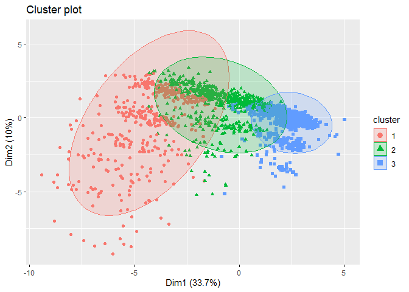<!-- -->

**red = cluster 1**

**green = cluster 2**

**blue = cluster 3**

Setting up the colors for the 3 clusters on the plot:

``` r
my.color.vector <- rep("green", times=nrow(new_df))
my.color.vector[market.k3$cluster==2] <- "blue"
my.color.vector[market.k3$cluster==3] <- "red"
```

Plot the cluster with the PC score with did earlier in the PCA part

``` r
par(pty="s")
plot(market_pc$scores[,1], market_pc$scores[,4], ylim=range(market_pc$scores[,1]), 
     xlab="PC 1", ylab="PC 2", type ='n', lwd=2)
text(market_pc$scores[,1], market_pc$scores[,4], cex=0.7, lwd=2,
     col=my.color.vector)
```

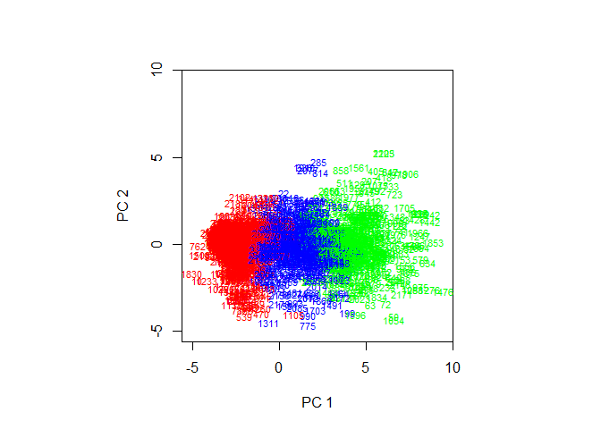<!-- -->

**Cluster 1 is low on PC 1 (lower spending amount and most likely
parents, more number of web visit, low income, low purchases on meat and
wine, low number of catalog purchases)**

**Cluster 2 is high on PC 1 higher spending amount and not a parent,
less number of web visit, high income, high purchases on meat and wine,
high number of catalog purchases**

**Cluster 3 is high on PC 3 (tend to not accepting any marketing
compaign and have high in store purchases)**

To make it easier to indentify the traits of each cluster Attach
clusters into the both dataframe (df and new\_df)

``` r
df$cluster=as.factor(market.k3$cluster)
new_df$cluster=as.factor(market.k3$cluster)
```

Pirate plot of the clusters on the interested variables

``` r
yarrr::pirateplot(formula = TotalPurchases ~ cluster, 
                  data = df,
                  main = "Pirateplot of Purchases",
                  xlab = "Clusters",
                  ylab = "Total Purchases", theme=1)
```

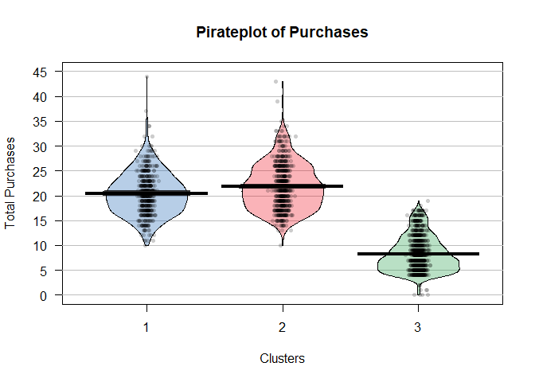<!-- -->

``` r
yarrr::pirateplot(formula = TotalAmountSpent ~ cluster, 
                  data = df,
                  main = "Pirateplot of Amount Spent",
                  xlab = "Clusters",
                  ylab = "Total Amount Spent", theme=1)
```

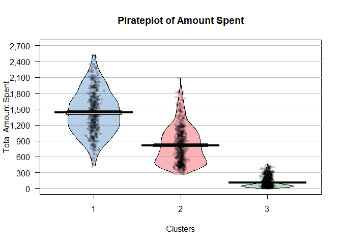<!-- -->

``` r
yarrr::pirateplot(formula = TotalAcceptedCmp ~ cluster, 
                  data = df,
                  main = "Pirateplot of Accepted Campaign",
                  xlab = "Clusters",
                  ylab = "Total Accepted Campaign", theme=1)
```

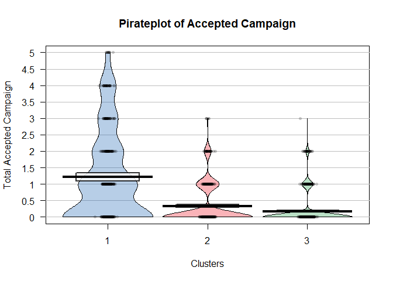<!-- -->

``` r
yarrr::pirateplot(formula = Childrenhome ~ cluster, 
                  data = df,
                  main = "Pirateplot of Children",
                  xlab = "Clusters",
                  ylab = "Children", theme=1)
```

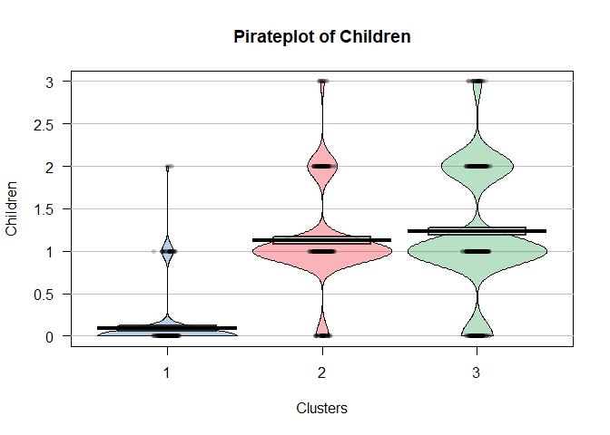<!-- -->

``` r
yarrr::pirateplot(formula = Age ~ cluster, 
                  data = df,
                  main = "Pirateplot of Age",
                  xlab = "Clusters",
                  ylab = "Age", theme=1)
```

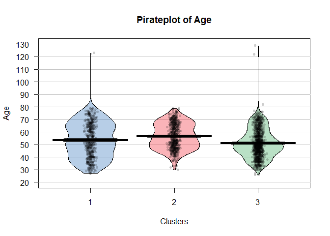<!-- -->

``` r
yarrr::pirateplot(formula = MaritalDummy ~ cluster, 
                  data = new_df,
                  main = "Pirateplot of Marital Status",
                  xlab = "Clusters",
                  ylab = "Marital Status", theme=1)
```

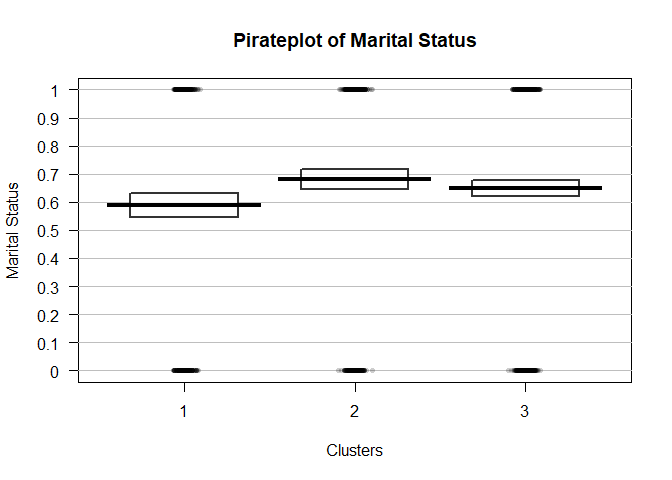<!-- -->

<font size="5"> Classification </font>

Decision tree used to classifty the number of purchases based on the
explanatory variables

``` r
library(rpart)
mc_tree <- rpart(TotalPurchases~ Age + TotalAcceptedCmp + Parent + MaritalDummy, data=new_df )
plot(mc_tree); text(mc_tree)
```

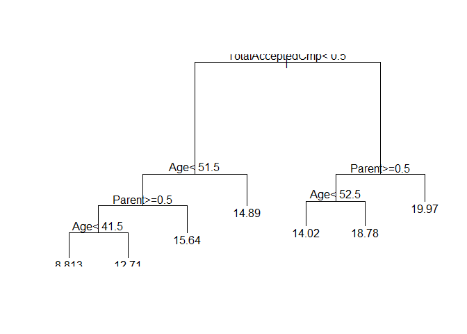<!-- -->

Decided to use random forrest to make the same classification. With
random forest have the abllity to help minimalize error by creating a
lot of random trees this can help us better our classification results

``` r
library(randomForest)
```

    ## Warning: package 'randomForest' was built under R version 4.1.3

    ## randomForest 4.7-1.1

    ## Type rfNews() to see new features/changes/bug fixes.

    ## 
    ## Attaching package: 'randomForest'

    ## The following object is masked from 'package:ggplot2':
    ## 
    ##     margin

``` r
purchase.rf <- randomForest(TotalPurchases~ Age + TotalAcceptedCmp + Parent + MaritalDummy, data = new_df, method ="class")

#Determine which variables are the most important factor to total puchases

purchase.rf$importance
```

    ##                  IncNodePurity
    ## Age                  4382.8538
    ## TotalAcceptedCmp     5351.8610
    ## Parent               4179.3705
    ## MaritalDummy          237.6432

**Total Accepted Campaign was the most influential in determining a
customers total purchases amount, followed by Age and then Pental
status, marital status was the least important factor**

  - Predict the total purchases for a customer
      - Age = 30 year old
      - Total accepted campaign = 1
      - Parent = 1 (yes)
      - Marital Status = 0 (single mom or single dad)

<!-- end list -->

``` r
newobs1 <- rbind( c(30,1,1,0))
dimnames(newobs1) <- list(NULL,c('Age','TotalAcceptedCmp', 'Parent', 'MaritalDummy'))
newobs1 <- data.frame(newobs1)
```

Using my random forrest classifier and decision tree to predict this
test customers purchase classification

``` r
predict(purchase.rf,newdata=newobs1, type='response')
```

    ##        1 
    ## 13.87944

Number of purchases predicted based on the random forest model

``` r
predict(mc_tree, newobs1)
```

    ##        1 
    ## 14.01807

Number of purchases predicted based based on the decision tree model
